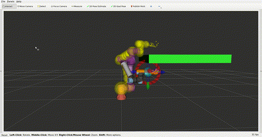
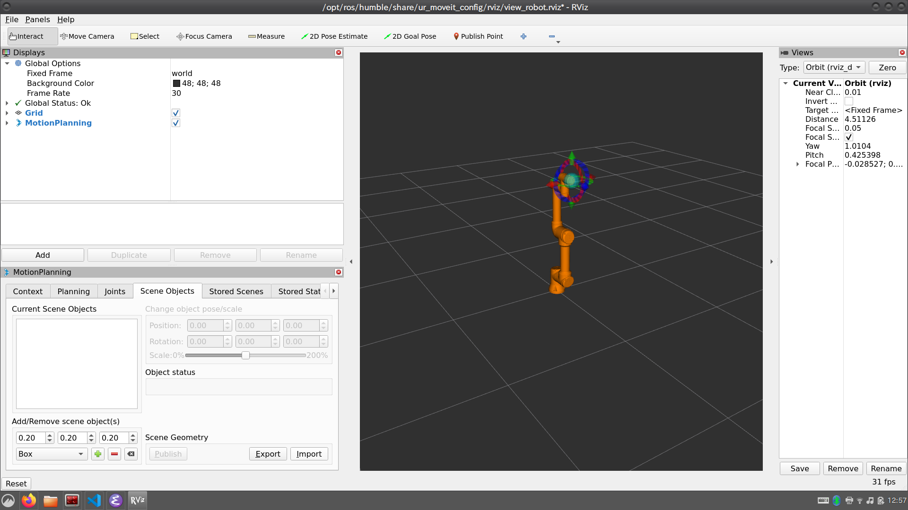
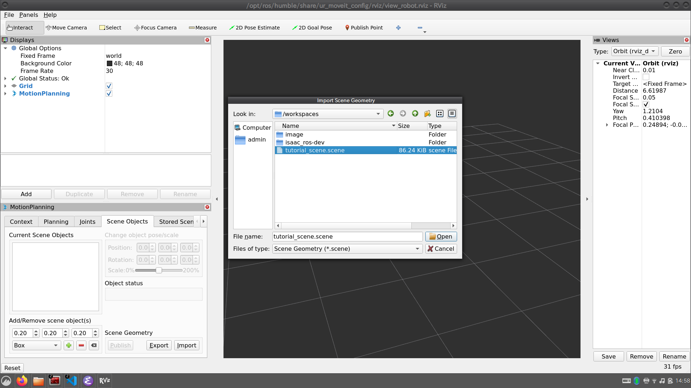
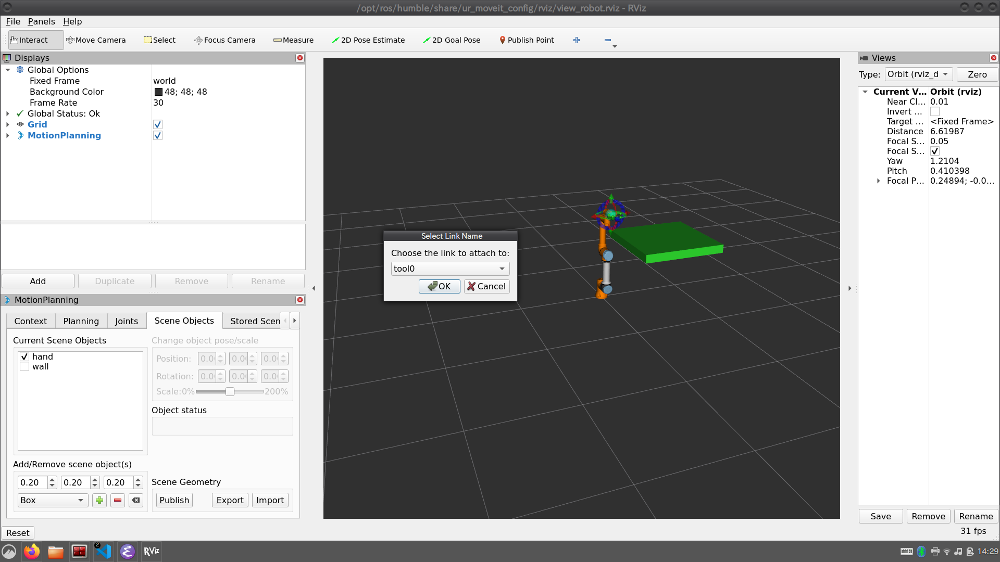
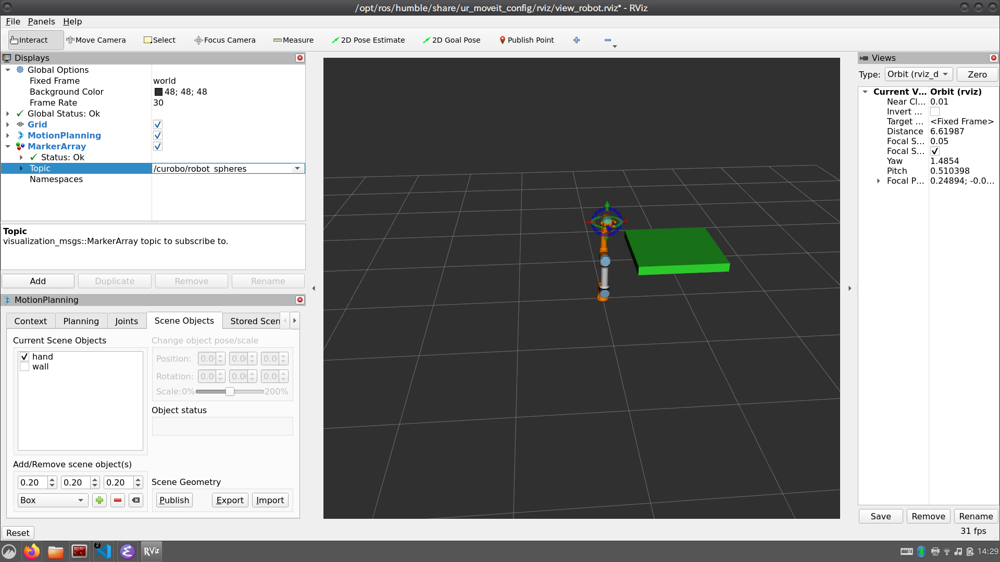
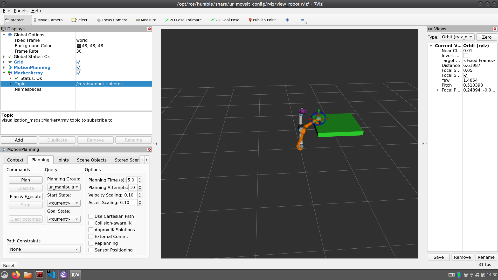
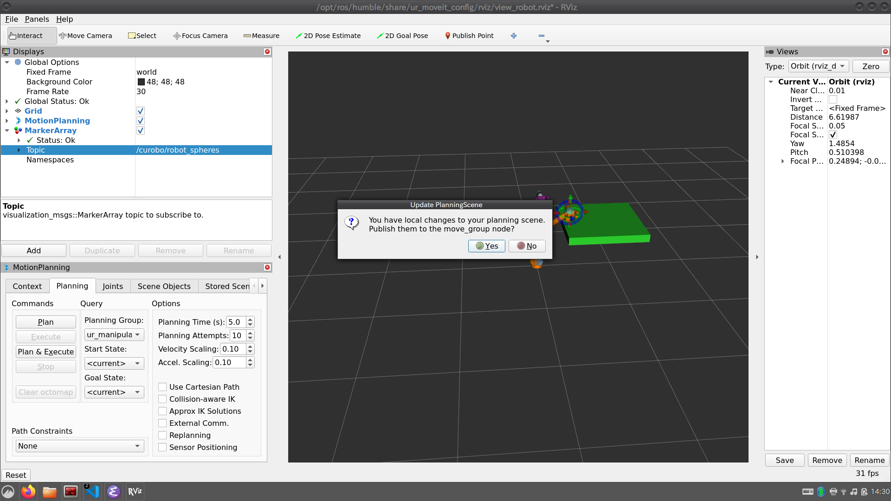
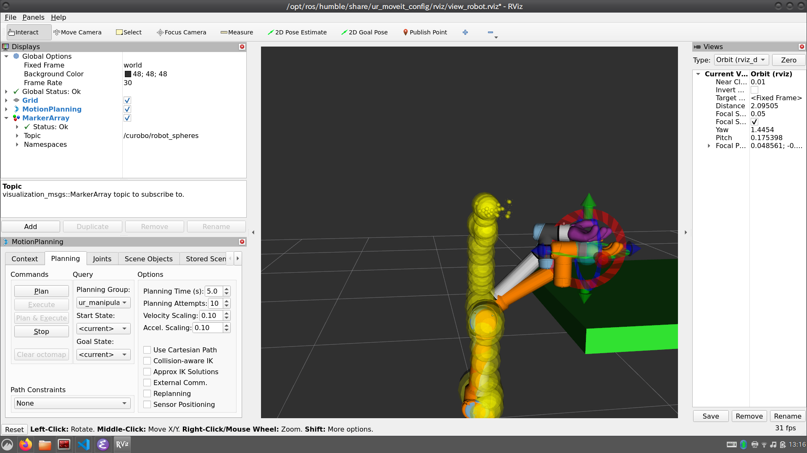

# curobo tutorial by using ur5e


This repository provides a environment for trying cumotion movit plugin with ur5e simulation.
Although a docker image 'wuisky/isaac_ros_dev-x86_64:latest' is prepared for this tutorial,
you can build by your self with [origin build script](https://github.com/NVIDIA-ISAAC-ROS/isaac_ros_common/blob/main/scripts/build_image_layers.sh) like follows if you are using x86_64 cpu:
```bash
./build_image_layers.sh  --image_key x86_64.ros2_humble.user --image_name isaac_ros_dev-x86_64
```

## Dependency
1. OS: Ubuntu 22.04 recommend([Jammy Jellyfish](https://qiita.com/cpx/items/8069cb7c9896e16febcf))
1. GPU and Memory: Ampere or higher NVIDIA GPU Architecture with 4 GB RAM or higher
1. [NVIDIA driver](https://www.nvidia.com/download/index.aspx)
1. [Docker and docker compose](https://docs.docker.com/engine/install/ubuntu/)
1. [nvidia-container-toolkit](https://docs.nvidia.com/datacenter/cloud-native/container-toolkit/latest/install-guide.html)
1. [vcstool](https://github.com/dirk-thomas/vcstool)

## Quick start
After cloning this repository, enter the directory of this repository and execute the following command:
```bash
mkdir -p isaac_ros-dev/src;vcs import --recursive isaac_ros-dev/src < .rosinstall
```
1. `docker compose up -d`
1. Enter the container with `docker exec -it isaac_ros_dev-x86_64-container bash`, then run `colcon build` and `source install/setup.bash`

### start ros2 nodes
Run the following commands in three terminals inside the container environment:
```bash
xacro -o ur5e.urdf /opt/ros/humble/share/ur_description/urdf/ur.urdf.xacro ur_type:=ur5e name:=ur5e;ros2 run isaac_ros_cumotion cumotion_planner_node --ros-args -p robot:=ur5e_preset_tool0_sphere.xrdf -p urdf_path:=$PWD/ur5e.urdf -p publish_robot_as_spheres:=true
```
this will cost for a while.After it shows "cuMotion is ready for planning queries!" you can proceed to next steps:
```bash
ros2 launch ur_robot_driver ur_control.launch.py ur_type:=ur5e robot_ip:=yyy.yyy.yyy.yyy initial_joint_controller:=joint_trajectory_controller use_fake_hardware:=true launch_rviz:=false
```
```bash
ros2 launch isaac_ros_cumotion_examples ur.launch.py ur_type:=ur5e use_fake_hardware:=true
```
you will see rviz is launched.



## try motion planning
1. In MotionPlainng GUI, select `Scene Objects` tab and press `Import` button, navigate to `workspaces/tutorial_scene.scene` and open it.
   
2. Check `hand` under `Current Scene Objects` and attach it to `tool0`
   
3. Add MarkerArray visualization and set topics to `/curobo/robot/spheres`. This will display  collision model used in curobo motion planner later.
   
4. Drag the interaction marker to the target pose and press `Plan & Execute` button. Then click `Yes` to publish planning scene.
    
5. You will see the collison model displayed in spheres and the robot is moving if the target pose is feasible.
   


# Notes
In this tutorial, wu use a custom [isaac_ros_cumotion](https://github.com/wuisky/isaac_ros_cumotion/tree/rosconjp-tutorial) branch, which is differ from upstream repository in follow aspects:

1. Take account for the attached object when executing path planning. This feature is reported in this [PR](https://github.com/NVIDIA-ISAAC-ROS/isaac_ros_cumotion/pull/5)
2. Add a ros param `publish_robot_as_spheres` for toggling publishing the robot sphere model as MarkerArray which is used in cumotion planner.
3. Add `ur5e_preset_tool0_sphere.xrdf` model file. 100 spheres are preseted in tool0 of ur5e model in this file for presenting attached object in cumotion planner.

# Reminder
The hand model is downloaded from [Thingiverse](https://www.thingiverse.com/thing:6676421/files),
and is licensed under the [Creative Commons - Attribution - Non-Commercial - Share Alike license](https://creativecommons.org/licenses/by-nc-sa/4.0/).

Although this tutorial is done by gui, you can achieve same operation by [move group api](https://moveit.picknik.ai/humble/doc/examples/move_group_interface/move_group_interface_tutorial.html)
which is more practical when developing your robot system.
This tutorial just provides a "glimpse" for using cumotion moveit path planning plugin.
